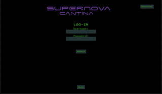
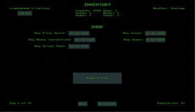
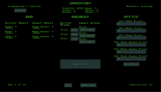
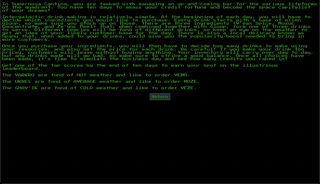

# Supernova Cantina

Supernova Cantina is a text based brewery simulator inspired by pc based games of the 80s/90s, but in the style of a classic sci-fi brew pub.

## Tech Stack

- Node
- Express
- PostgresSQL
- Sequelize
- Bcrypt
- JavaScript
- EJS
- CSS

## Deployment

- Heroku
- Heroku Postgres

## Fonts used for theme

- https://fonts.google.com/specimen/Press+Start+2P
- https://www.dafont.com/space-age.font

## Mvp

- Display a functioning text based simulation game.
- The game must be built using the desired stack.
- Ui/Ux should remind the user of text based sim games of the 80s/90s.
- Sci-fi theme a la Star Wars, The Matrix, Starcraft: Brood War, etc.
- Users can register a username and password.
- Username and password must be stored inside a postgres database.
- Site must be fully and successfully deployed using Heroku.

## Screenshots of Supernova Cantina

Login/Register

Shop for materials

Brew your brews

Tutorial

## Developer Team

- Matt Summers - [Github][1]
  
- Jorge Rodriguez - [Github][2]
  
- Jordan Boardman - [Github][3]
  

[1]: https://github.com/msummx
[2]: https://github.com/jorgerodriguez860
[3]: https://github.com/jordanboardman

## Deployed site. Enjoy!

https://supernova-cantina.herokuapp.com/
